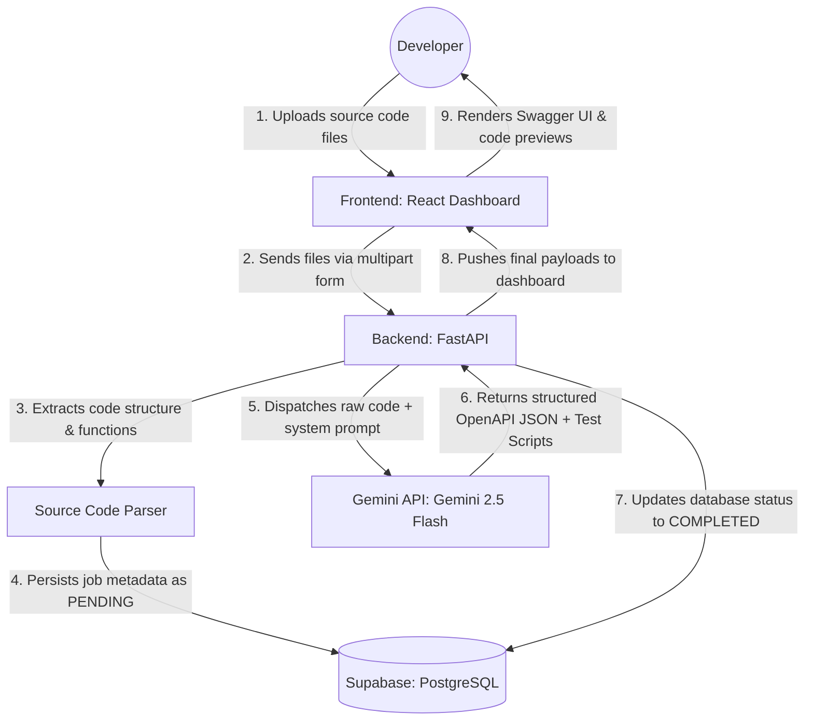

# DocuTest AI

**DocuTest AI** is an intelligent platform where developers can upload source code files from their backends (FastAPI, Express, or Flask). The AI engine analyzes the code structure, extracts data contracts, generates official OpenAPI specifications, and creates automated test scripts focused on functional coverage and DevSecOps validation.

## Phase 1: Architecture & Requirements

### Functional Requirements (FR)
- **Upload and Parsing**: System receives source code files (e.g., `main.py`, `routes.js`) via upload in the web platform.
- **OpenAPI Spec Generation**: AI engine extracts paths, HTTP verbs, input parameters (query/body), and return status codes, generating a valid JSON/YAML in OpenAPI 3.0 standard.
- **Automated Test Generation**: AI writes complete functional test scripts (e.g., using `pytest` for Python or `jest` for Node.js) based on the found routes.
- **DevSecOps Predictive Analysis**: For sensitive routes (POST, PUT, DELETE), the system strictly injects tests that validate the absence/presence of authentication headers (`Authorization`), testing 401 Unauthorized and 403 Forbidden error scenarios.
- **Interactive Visualization**: Display interactive documentation (Swagger UI style) and generated test files directly in the web dashboard.

### Non-Functional Requirements (NFR)
- **Asynchronous Processing**: Complex or multiple files must be processed in the background to avoid HTTP timeouts.
- **Strict Schema**: AI engine responses regarding the OpenAPI specification must follow a rigid JSON schema to prevent rendering breaks in the UI.
- **History Persistence**: Developers must be able to query past analyses and download old specs/tests.

## Phase 2: System Design & Data Flow

The data flow follows an asynchronous, job-oriented pipeline, ensuring isolation between the file upload and the heavy LLM inference process.



## Phase 3: AI Engine Strategy

The system's intelligence relies on the accurate extraction of software contracts. We utilize Gemini's **Structured Outputs (Json Mode)** to force the model to return a twin object containing both the Swagger spec and clean test code.

### Prompt Engineering and Context Injection
- **Strict System Instruction**: The model must act strictly as a DevSecOps Engineer specializing in API architecture and Quality Assurance (QA).
- **Target Output Schema**: The Gemini API will strictly respond in this JSON format:
  ```json
  {
    "openapi_spec": { ... }, 
    "test_suite": {
      "filename": "test_auth_routes.py",
      "code": "..."
    },
    "security_insights": [
      {"route": "/items", "issue": "Missing auth validation check on DELETE verb"}
    ]
  }
  ```
- **DevSecOps Rule Injection**: The system prompt will include a deterministic security guideline: *"For every identified route with mutable methods (POST, PUT, PATCH, DELETE), generate an additional test case that simulates a request without tokens or authorization headers, ensuring that the expected behavior returns security error codes (401 or 403)."*

## Phase 4: Full-Stack Technologies

### Backend (FastAPI)
- **Primary Routes**:
  - `POST /api/v1/docs/analyze`: Receives file payload, triggers background execution using FastAPI `BackgroundTasks`, and returns a tracking ID.
  - `GET /api/v1/docs/jobs/{id}`: Queries processing status (Pending, Completed, Failed) and delivers structured data once finished.
- **Internal Modules**: 
  - A static analyzer (`Parser`) to sanitize and tokenize uploaded code before dispatching to the Gemini API, mitigating unnecessary context window overflows.

### Frontend (React)
- **Dashboard & Components**:
  - File drag-and-drop zone (`react-dropzone`) with visual code extension highlighting (`.py`, `.js`, `.ts`).
  - Split panel using structured Tabs:
    - **Tab 1: Swagger UI**: Integration of the `swagger-ui-react` npm package, dynamically fed by the JSON produced by Gemini.
    - **Tab 2: Test Suite**: Read-only code editor (`monaco-editor` or `react-syntax-highlighter`) displaying the script ready for copy/download.
    - **Tab 3: Security Insights**: An executive summary listing potential validation flaws found in the original file's static logic.

### Database
- **Supabase (PostgreSQL)** for relational data and audit metadata tracking (jobs and their statuses).

## Phase 5: Observability & Deployment

### Infrastructure Strategy
- **Frontend Deployment**: Hosted on Vercel, leveraging the global edge network to optimize rendering time for the dashboard and Swagger.
- **Backend Deployment**: Hosted on Render as a Python-based Web Service. The internal async processing takes advantage of FastAPI's asynchronous concurrency model.
- **Environment Variables**: Centralized production credentials storage in Render/Vercel (protecting the Supabase connection token and `GEMINI_API_KEY`).

### Monitoring & Metrics (Observability)
- **AI Performance Metrics**: Systematic monitoring of Gemini generation latency time and token consumption per analysis call.
- **Post-AI Automatic Validation**: Implementation of a schema validation block (`Try/Catch`) in the backend. If the JSON returned by the model fails OpenAPI compliance validation, the error is structured in logs, and the Job status is marked as `FAILED` with debug details, preventing broken data from reaching the UI.
