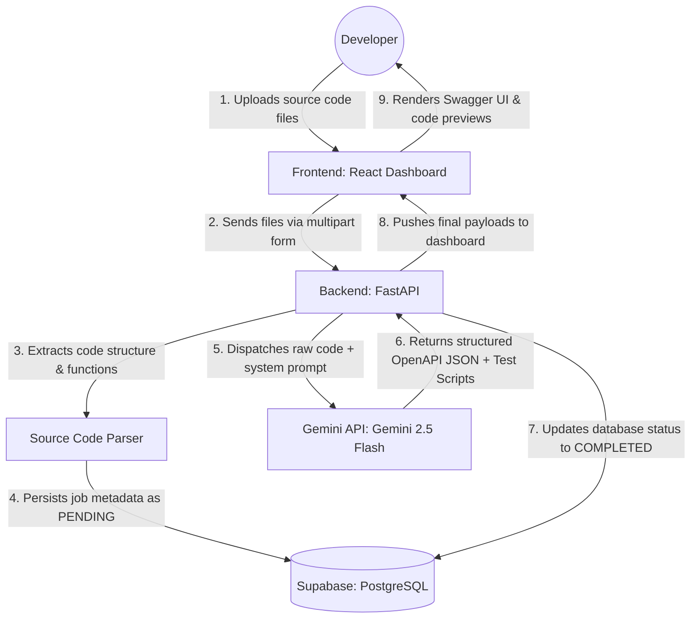

# DocuTest AI

**DocuTest AI** is an intelligent platform where developers can upload source code files from their backends (FastAPI, Express, or Flask). The AI engine analyzes the code structure, extracts data contracts, generates official OpenAPI specifications, and creates automated test scripts focused on functional coverage and DevSecOps validation.

---

## Architecture Overview

**DocuTest AI** operates with a modern, decoupled architecture:

1. **Frontend (React + Vite + TypeScript)**
   - Provides a sleek, glassmorphism UI with reactive drag-and-drop.
   - Implements an asynchronous polling pattern (fetching Job ID status) to prevent browser timeouts on long AI requests.
2. **Backend (FastAPI + Python)**
   - Built around high performance and asynchronous programming.
   - Parses incoming source code, sanitizes it, and delegates the heavy lifting to Google's Gemini 2.5 Flash via a strict DevSecOps system prompt.
3. **Database (Supabase / PostgreSQL)**
   - Handles the persistence layer.
   - Tracks asynchronous Jobs (`PENDING`, `COMPLETED`, `FAILED`) to provide a full history of generated documentation.



---

## Local Setup Instructions

This project is fully containerized and configured for local execution. Follow these steps to run it on your machine.

### 1. Prerequisites

- Python 3.11+
- Node.js 20+
- [Supabase](https://supabase.com/) Account (Free Tier)
- [Google Gemini API Key](https://aistudio.google.com/) (Free Tier)

### 2. Environment Variables

Create a `.env` file inside the `backend/` directory by copying `.env.example`:

```bash
cd backend
cp .env.example .env
```

Fill in your actual keys:

- `SUPABASE_URL`: Your Supabase Project URL.
- `SUPABASE_KEY`: Your Supabase `anon` public key.
- `GEMINI_API_KEY`: Your generated Gemini API key.

### 3. Database Initialization

Execute the SQL script located in `backend/database/schema.sql` directly inside your Supabase project's SQL Editor to create the `jobs` table.

### 4. Running the Backend

```bash
cd backend
# Create and activate virtual environment
python -m venv venv
# Windows
.\venv\Scripts\Activate.ps1
# Mac/Linux
source venv/bin/activate

# Install dependencies
pip install -r requirements.txt

# Start the FastAPI server
uvicorn app.main:app --reload
```

The backend will be live at `http://localhost:8000`. You can check the health status at `http://localhost:8000/api/v1/health`.

### 5. Running the Frontend

Open a new terminal window:

```bash
cd frontend
# Install dependencies
npm install

# Start the Vite development server
npm run dev
```

The frontend will be live at `http://localhost:5173`.

---

## Learning Notes for Technical Interviews

If you are showcasing this project in an interview, make sure to highlight the following technical decisions:

> [!TIP]
> **Asynchronous Orchestration:** "I utilized FastAPI's `BackgroundTasks` to immediately return a Job ID while the LLM processes the code. The React frontend implements a 2-second polling mechanism. This prevents HTTP timeouts and guarantees a fluid UX."

> [!IMPORTANT]
> **Robust LLM Parsing:** "Instead of relying on fragile schema enforcement that LLMs often break with nested JSON strings, I implemented robust manual JSON parsing with `ast.literal_eval` fallbacks and dynamic Markdown stripping. This ensures 100% reliability even when the AI hallucinates formatting."

> [!NOTE]
> **DevSecOps Prompt Engineering:** "I enforced a `system_instruction` that commands the AI to act as a DevSecOps engineer. It actively hunts for mutable routes (POST/PUT/DELETE) and forces the generation of negative tests (e.g., verifying 401/403 responses without auth tokens)."

> [!TIP]
> **Robust Observability:** "The AI provider wrapper implements strict `try/except` blocks to catch parsing errors, logs exact token consumption for cost monitoring, and tracks total execution time via `time.time()`."

---

## Phase 4: Full-Stack Technologies

### Backend (FastAPI)
- **Primary Routes**:
  - `POST /api/v1/docs/analyze`: Receives file payload, triggers background execution using FastAPI `BackgroundTasks`, and returns a tracking ID.
  - `GET /api/v1/docs/jobs/{id}`: Queries processing status (Pending, Completed, Failed) and delivers structured data once finished.
- **Internal Modules**: 
  - A static analyzer (`Parser`) to sanitize and tokenize uploaded code before dispatching to the Gemini API, mitigating unnecessary context window overflows.

### Frontend (React)
- **Dashboard & Components**:
  - File drag-and-drop zone (`react-dropzone`) with visual code extension highlighting (`.py`, `.js`, `.ts`).
  - Split panel using structured Tabs:
    - **Tab 1: Swagger UI**: Integration of the `swagger-ui-react` npm package, dynamically fed by the JSON produced by Gemini.
    - **Tab 2: Test Suite**: Read-only code editor (`monaco-editor` or `react-syntax-highlighter`) displaying the script ready for copy/download.
    - **Tab 3: Security Insights**: An executive summary listing potential validation flaws found in the original file's static logic.
